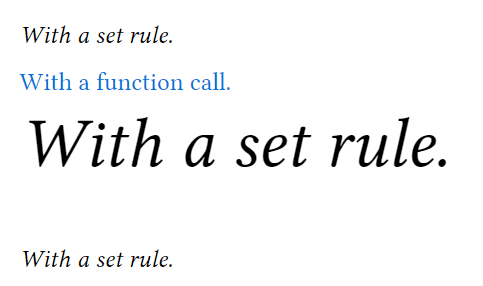

# Typst-超越$LaTeX$的文档排版工具

## 前言

> ***今天学了一天Typst，给我的感觉就是相较于$LaTeX$ ，Typst就是神！***

我日常做笔记使用的软件是typora，typora的好处是所见即所得，即时渲染你所写的markdown语法。在日常使用中是十分便捷的。但是进行论文撰写的时候，文字排版显得格外重要，最常用的就是word。Word软件排版虽然很强大，但是需要下功夫去操作，与$\LaTeX$相比就稍微逊色一点。

$\LaTeX$ 具有专业的排版输出能力，产生的文档看上去就像“印刷品”一样，具有方便而强大的数学公式排版能力，很容易生成复杂的专业排版元素，如脚注、交叉引用、参考文献、目录等，强大的可扩展性。世界各地的人开发了数以千计的$\LaTeX$宏包用于补充和扩展 $\LaTeX$的功 能，能够促使用户写出结构良好的文档——而这也是$\LaTeX$ 存在的初衷<sup>[1]</sup>。同时，也存在着一些问题，(1) 安装包过大，安装相对较难；（2）相比“所见即所得”的模式有一些不便，为了查看生成文档的效果，用户总要不停地编译，这是最大的鸡肋（虽然也有插件可以即时查看，但是编译的速度过慢）。我之前也参照别人的模板写过一个天津大学的$\LaTeX$模板<sup>[2]</sup>。

最近，有团队开发了[typst](https://github.com/typst/typst)<sup>[3]</sup>，宣称“Typst 是一种新的基于标记的文档排版系统，其设计与 $\LaTeX$一样强大，同时更易于学习和使用”，可以创建和使用更加强大的模板。Typst 是编写任何长篇文本（如论文、文章、科学论文、书籍、报告和家庭作业）的不错选择。此外，Typst 非常适合任何包含数学符号的文档，例如数学、物理和工程领域的论文。最后，由于其强大的样式和自动化功能，它是任何具有共同样式的文档集（例如丛书）的绝佳选择。

作为喜欢吃螃蟹的人，第一时间就尝试了一下，感觉还行，就在此做一下介绍。

## 安装

Typst提供预编译版和源码供开发者使用，

对于Linux或者macos可以使用如下命令安装：

```bash
# macOS or Linux using Homebrew
brew install typst

# Arch Linux
pacman -S typst
```

对于windows用户直接去他们的[仓库](https://github.com/typst/typst/releases/tag/v23-03-28)<sup>[4]</sup>下载编译好的文件放到自己的目录，并添加环境变量即可使用。

Typst官方也提供了网页版(https://typst.app/)供使用

当安装了Typst之后，可以使用如下命令将撰写的代码转换为pdf：

```bash
typst file.typ
# 指定生成目录
typst path/to/source.typ path/to/output.pdf
```

也可以一边修改源文件一边编译：

```bash
typst --watch file.typ
```

因为我使用的是vscode，最近有开发者开发了`Typst LSP` vscode插件(vscode扩展仓库下载)，结合pdf预览插件就可以实现即时预览。效果如下图所示：


## 使用

### 简单的示例

如下为官方给出的例子，具体效果见上图。

```typst
#set page(width: 10cm, height: auto)
#set heading(numbering: "1.")

= Fibonacci sequence
The Fibonacci sequence is defined through the
recurrence relation $F_n = F_(n-1) + F_(n-2)$.
It can also be expressed in _closed form:_

$ F_n = round(1 / sqrt(5) phi.alt^n), quad
phi.alt = (1 + sqrt(5)) / 2 $

#let count = 
#let nums = range(1, count + 1)
#let fib(n) = (
if n <= 2 { 1 }
else { fib(n - 1) + fib(n - 2) }
)

The first #count numbers of the sequence are:

#align(center, table(
columns: count,
..nums.map(n => $F_#n$),
..nums.map(n => str(fib(n))),
))
```

### Markdown|$LaTeX$|Typst对比

|          | Typst               | $LaTeX$                                    | Markdown                   |
| -------- | ------------------- | ------------------------------------------ | -------------------------- |
| 标题     | \=,\=\=,\=\=\=      | \section,\subsection,\subsubsection        | \#,\##,\###                |
| 有序列表 | +                   | \begin{enumerate} \item[ ] \end{enumerate} | 1.  2.                     |
| 无序列表 | -                   | \begin{itemize} \item[+] \end{itemize}     | -,+                        |
| 图片引用 | #image("file")      | \includegraphics{file}                     | !\[filename\]\("file"\)    |
| 斜体     | \_ \_               | \textit                                    | \_ \_                      |
| 加粗     | \* \*               | \textbf                                    | \*\*  \*\*                 |
| 代码块   | ```                 | \begin{verbatim}   \end{verbatim}          | ```                        |
| 公式     | \$ \$               | \begin{equation}   \end{equation}          | 行内\$ \$，行间\$\$   \$\$ |
| 链接     | #link("x.com")[des] | \href{x.com}{des}                          | \[des\]\(x.com\)           |
| 表格     | #table()            | \begin{tabular}   \end{tabular}            | \|  \|  \|                 |

从上表可得，相对来说Typst的使用命令还是比较简洁的。

### 语法

#### 图片

直接引用图片

`#image("1.png",width:70%)`

使用`#figure`设置图片格式，在figure后面可以添加`<>`label并在文中使用@引用。

```typst
#figure(
  image("glacier.jpg", width: 70%),
  caption: [
    _Glaciers_ form an important part
    of the earth's climate system.
  ],
)
```

```typst
Glaciers as the one shown in
@glaciers will cease to exist if
we don't take action soon!

#figure(
  image("glacier.jpg", width: 70%),
  caption: [
    _Glaciers_ form an important part
    of the earth's climate system.
  ],
) <glaciers>
```


#### 公式

Typst与markdown不同，有自己的公式语法，一个是不管是行间还是行内公式，都是用\$ \$，另一个是不需要在特殊变量名前加斜杠\\。如果想不改变字体，可以使用""引用

```
The equation $Q = rho gamma A v + C$
defines the glacial flow rate.

The flow rate of a glacier is given
by the following equation:

$ Q = rho A v + "time offset" $

Total displaced soil by glacial flow:

$ 7.32 beta +
  sum_(i=0)^nabla
    (Q_i (a_i - epsilon)) / 2 $
```


#### 文字

使用text自定义文本样式,有两种定义方法：(1) `#set text(font:"18pt")` 之后的文字都按此格式；(2)`#text(font:18pt)[text ]`,只修改此处的文字。

text具有如下的参数，需要注意的是，如果使用键值对需要加引号\"！

```python
text(
	set font: stringarray,    
	set fallback: boolean,    
	set style: string,
	set weight: integerstring,
	set stretch: ratio,
	set size: length,
	set fill: color,
	set tracking: length,
	set spacing: relative length,
	set baseline: length,
	set overhang: boolean,
	set top-edge: lengthstring,
	set bottom-edge: lengthstring,
	set lang: string,
	set region: nonestring,
	set dir: autodirection,
	set hyphenate: autoboolean,
	set kerning: boolean,
	set alternates: boolean,
	set stylistic-set: noneinteger,
	set ligatures: boolean,
	set discretionary-ligatures: boolean,
	set historical-ligatures: boolean,
	set number-type: autostring,
	set number-width: autostring,
	set slashed-zero: boolean,
	set fractions: boolean,
	set features: arraydictionary,
	content,
) -> content
```

```typst
#set text(
  font: "New Computer Modern",
  size: 10pt,
  style:"italic",
)

With a set rule.

#emph(text(blue)[
  With a function call.
])

#text(28pt)[With a set rule.]

With a set rule.
```



#### 页面

通过`#set page()`设置页面格式

```typst
page(
	set paper: string,
	set width: autolength,
	set height: autolength,
	set flipped: boolean,
	set margin: autorelative lengthdictionary,
	set columns: integer,
	set fill: nonecolor,
	set numbering: nonestringfunction,
	set number-align: alignment2d alignment,
	set header: nonecontent,
	set header-ascent: relative length,
	set footer: nonecontent,
	set footer-descent: relative length,
	set background: nonecontent,
	set foreground: nonecontent,
	content,
) -> content
```

```typst
#set page(
  paper: "a6",
  margin: (x: 1.8cm, y: 1.5cm),
)
```

#### 段落

通过`#set par()`设置段落格式

```typst
par(
	set leading: length,   # 行间距
	set justify: boolean,  # 是否行中对齐文本
	set linebreaks: autostring,  # 如何确定换行符
	set first-line-indent: length, # 首行缩进
	set hanging-indent: length,   # 除首行外其余行的缩进
	set body: content,
) -> content
```


```typst
#set par(first-line-indent: 2em, justify: true)

We proceed by contradiction.
Suppose that there exists a set
of positive integers $a$, $b$, and
$c$ that satisfies the equation
$a^n + b^n = c^n$ for some
integer value of $n > 2$.

Without loss of generality,
let $a$ be the smallest of the
three integers. Then, we ...
```


#### 标题

通过`#set heading()`设置标题格式

```typst
heading(
	set level: integer,   # 标题深度
	set numbering: nonestringfunction,  # 标题序号
	set outlined: boolean,    # 下划线
	content,
) -> content
```

```
#set heading(numbering: "1.a)")

= Introduction
In recent years, ...

== Preliminaries
To start, ...

#set heading(numbering: "1.")

= Introduction
#lorem(10)

== Background
#lorem(12)

== Methods
#lorem(15)
```


```typst
// 高度自定义标题格式
#show heading.where(
  level: 1
): it => block(width: 100%)[
  #set align(center)
  #set text(12pt, weight: "regular")
  #smallcaps(it.body)
]

#show heading.where(
  level: 2
): it => text(
  size: 11pt,
  weight: "regular",
  style: "italic",
  it.body + [.],
)
```

#### 函数

函数调用是typst的特色，用户可以定义并调用函数来自定义输出格式。

可以通过指定参数列表后跟 => 和函数体来创建匿名函数。如果您的函数只有一个参数，则参数列表周围的括号是可选的。匿名函数主要用于显示规则。

使用`#let`设置变量，通过`#`调用

```typst
// 调用函数
#list([A], [B])

#enum(start: 2)[A][B]

#list[A][B]

#let alert(body, fill: red) = {
  set text(white)
  set align(center)
  rect(
    fill: fill,
    inset: 8pt,
    radius: 4pt,
    [*Warning:\ #body*],
  )
}

#alert[
  Danger is imminent!
]

#alert(fill: blue)[
  KEEP OFF TRACKS
]

# 匿名函数
#show "once?": it => [#it #it]
once?

#let amazed(term) = box[✨ #term ✨]

You are #amazed[beautiful]!
```


```typst
#let amazed(term, color: blue) = {
  text(color, box[✨ #term ✨])
}

You are #amazed[beautiful]!
I am #amazed(color: purple)[amazed]!

#show: amazed
I choose to focus on the good
in my life and let go of any
negative thoughts or beliefs.
In fact, I am amazing!
```


进一步地，可以结合let、set和show定义排版规则

```
#let template(doc) = [
  #set text(font: "Inria Serif")
  #show "something cool": [Typst]
  #doc
]

#show: template
I am learning something cool today.
It's going great so far!
```

用户可以将自定义的一些规则储存在typ文件中，然后使用`import`命令导入该文件，从而使主文件保持整洁

## 实践

写了一个简陋的天大毕业论文模板（只实现了标题和段落格式，图表等内容待定）。

```typst
// 设置页面
#set page(
    paper:"a4",
    margin: (
        top:27.5mm,
        bottom:25.4mm,
        left:35.7mm,
        right:27.7mm
    ),
    numbering:"1",
    number-align:center,
)
// 设置正文文字格式
#set text(
    font:("Times New Roman","SimSun"),
    style:"normal",
    weight:"regular",
    size: 12pt,
)
// 设置段落
#set par(
    leading:20pt,
    justify: true,
    first-line-indent: 2em,
)
// 设置标题格式
#set heading(numbering: "1.1.1.1")
#show heading: it => locate(loc => {
    let levels = counter(heading).at(loc)
    let deepest = if levels != () {
        levels.last()
    } else {
        1
    }

    set text(12pt)
    if it.level == 1 [
        #if deepest !=1 {
            pagebreak()
        }
        #set par(first-line-indent: 0pt)
        #let is-ack = it.body in ([Acknowledgment], [Acknowledgement])
        #set align(center)
        #set text(if is-ack { 15pt } else { 15pt },font:"SimHei")
        #v(36pt, weak: true)
        #if it.numbering != none and not is-ack {
        numbering("第1章.", deepest)
        h(7pt, weak: true)
        }
        #it.body
        #v(36pt, weak: true)
    ] else if it.level == 2 [
        #set par(first-line-indent: 0pt)
        #set text(size:14pt,font:"SimHei")
        #v(24pt, weak: true)
        #if it.numbering != none {
        numbering("1.1.",..levels)
        h(7pt, weak: true)
        }
        #it.body
        #v(24pt, weak: true)
    ] else if it.level == 3 [
        #set par(first-line-indent: 0pt)
        #set text(size:14pt,font:"SimHei")
        #v(15pt, weak: true)
        #if it.numbering != none {
        numbering("1.1.1.",..levels)
        h(7pt, weak: true)
        }
        #it.body
        #v(15pt, weak: true)
    ] else [
        #set par(first-line-indent: 0pt)
        #set text(size:12pt,font:"SimHei")
        #v(12pt, weak: true)
        #if it.numbering != none {
        numbering("1.1.1.1.",..levels)
        h(7pt, weak: true)
        }
        #it.body
        #v(12pt, weak: true) 
    ]
})


= 一级标题

//每页第一行的段落不会被缩进，需要额外设置
// #h(2em)两个字符的空格
#h(2em)#lorem(30) \

== 二级标题

chatgpt:阳光明媚的早晨，一只小鸟在树枝上欢快地唱着歌，远处传来了儿童的欢笑声，空气中弥漫着花香和新鲜的草味，这是一个充满生机和活力的日子。突然间，一阵微风吹来，树叶沙沙作响，让人感到一阵舒爽。这个美好的早晨让人心情愉悦，让人感受到大自然的魅力和美妙。\
=== 三级标题
== 二级标题
=== 三级标题
#lorem(30) \
==== 四级标题
==== 四级标题
#lorem(30) \
= 一级标题
== 二级标题
=== 三级标题
==== 四级标题

```

## 后话

Typst的文档做得很好，对于列表，可以使用`+`进行创建，也可以使用函数`#enum`进行自定义，总体而言，Typst的可玩性很强。本文只是对某些方面进行了简单的介绍，如果感兴趣的话，可以查阅其[官方文档](https://typst.app/docs/)<sup>[5]</sup>。

对于像word或者$LaTeX$那样分开设置中英文字体以及页眉页脚根据页码设置，可以使用Typst内的函数进行控制，但这有些高阶玩法了，需要自行探索。

本文所述内容对于日常做做笔记啥的来说绰绰有余，相信随着Typst的不断更新，必将有代替$LaTeX$的一天。

## 链接

[1] https://zhuanlan.zhihu.com/p/369311806

[2] https://github.com/Zuttergutao/Latex

[3] https://github.com/typst/typst

[4] https://github.com/typst/typst/releases/tag/v23-03-28

[5] https://typst.app/docs/